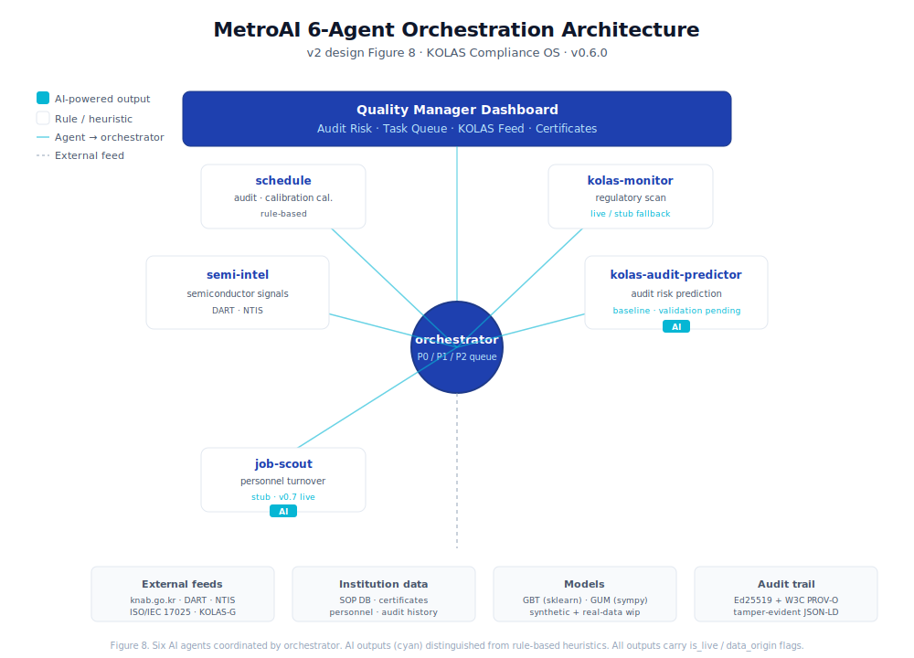

# 📐 MetroAI — KOLAS Compliance OS + Inverse Metrology Engine

> **Measurement uncertainty MCP server + 6 AI agents + verifiable audit trail + uncertainty-aware ML inverse metrology (11 instruments).**
> ISO/IEC 17025 + KOLAS-accredited laboratories.

[](https://github.com/kyb8801/metroai/actions)
[](LICENSE)
[](https://www.python.org)
[](https://github.com/kyb8801/metroai/releases)
[](https://github.com/kyb8801/metroai/actions)
[](https://mcpize.com/mcp/measurement-uncertainty)
[](https://glama.ai/mcp/servers/kyb8801/metroai)

---

> **🇰🇷 한국어 요약** — MetroAI는 한국 KOLAS 인정기관(1,200+)의 시험·교정·표준물질 업무를 위한
> **AI 컴플라이언스 OS + 측정불확도 MCP 서버**입니다. GUM/MCM 불확도 엔진, 6종 AI 에이전트,
> Ed25519+PROV-O 검증가능 감사추적, 역계측 엔진(11개 장비)을 제공하며, 자동화 테스트 214건과
> [정직성 규칙](docs/HONESTY_NOTES.md)·[Trustworthy AI 정책](docs/TRUSTWORTHY_AI.md)으로 AI 산출물의 신뢰성을 관리합니다.
> 상세 한국어 안내는 [아래 섹션](#한국어-사용자를-위한-안내) 참고.

## What is this?

A **compliance operating system** for Korea's 1,200+ KOLAS-accredited testing,
calibration, RMP, and inspection institutions — and a **measurement
uncertainty MCP server** that any MCP-compatible AI client (Claude Desktop,
Cursor, VS Code, etc.) can call directly.

As of v0.8.0 it also ships an **inverse metrology engine** (`metroai.inverse`):
where the calibration templates compute uncertainty *forward* (inputs → U),
the inverse engine recovers a **parameter and its uncertainty from a measured
signal** (spectrum / image / diffraction) across 11 instruments, all sharing
one GUM core and one ML-uncertainty core.

Built solo by **Youngbum Kim** (Ph.D.) — a practitioner from a KOLAS-accredited ISO 17034
reference-material producer who supported accreditation audits and got
tired of redoing everything in Excel and email every quarter.

---

## Quickstart — 30 seconds

### As an MCP server (Claude Desktop, Cursor, etc.)

```bash
claude mcp add --transport http measurement-uncertainty \
  https://measurement-uncertainty.mcpize.run
```

→ then ask your AI: *"Compute the GUM uncertainty for this voltage divider"*
or *"Apply the TEM lattice template at 95% confidence"*.

### As a web app (Streamlit)

```bash
pip install -e ".[dev,ml]"
streamlit run app.py
```

Live demo: temporarily offline - migrating to Hugging Face Spaces (Roadmap P2). Run locally with the two commands above.

### As a Python library

```bash
pip install metroai
```

```python
from metroai.templates import create_tem_lattice_calculator

calc = create_tem_lattice_calculator()
result = calc.calculate()
print(f"d = {result.measurand_value:.6f} nm "
      f"± {result.expanded_uncertainty:.4e} (k={result.coverage_factor:.2f})")
```

### Inverse engine (NEW in v0.8.0)

```python
from metroai.inverse import uncertainty, ml_inverse, INSTRUMENTS

# unified GUM budget — every instrument calls this
uc, rows = uncertainty.budget([("scan_calib", 1, 0.0016), ("noise", 1, 0.0001)])
print(uc, uncertainty.expand(uc, k=2))           # u_c, U(k=2)

# ML inverse + ML uncertainty (instruments that have a forward library)
mdl = ml_inverse.MLInverse().fit(X_train, y_train)
out = mdl.predict(X_query)                        # pred + epistemic std + conformal half-width
```

---

## What MetroAI does

### 0. User-fit features (NEW in v0.7.0) — for KOLAS lab operators

After surveying the SEM-lab-operator journey end-to-end, four new features
landed in v0.7.0 specifically to cover the **applicant** side of the
accreditation workflow:

- **🔬 Domain-specific entry wizard** — Landing page asks "Which instrument are
  you accrediting?" Five paths: SEM / TEM / AFM / OCD / general measurement.
  Each one routes to a domain dashboard with only the standards, KOLAS steps,
  uncertainty templates, and SOP checks that matter for that domain.
- **📚 Domain-specific KOLAS guides** — Per-domain content: applicable ISO
  standards (4–6 per domain), six-step KOLAS accreditation process with
  typical pitfalls, 3–4 common nonconformities with root cause + MetroAI fix,
  and the typical uncertainty budget components. Content sourced from public
  ISO/SEMI/KOLAS-G-002 documents.
- **📝 KOLAS application form auto-generator** — Fill an organization profile
  once → ReportLab generates a 7-section ISO/IEC 17025-style accreditation
  application PDF (organization info, scope, personnel, equipment, reference
  standards, environmental control, quality system). Generic template; final
  submission should be cross-checked against KAB's latest official form.
- **📋 Domain SOP rule-based checklist** — Each domain ships with a 10-item
  SOP checklist derived from KOLAS-evaluator-perspective common findings.
  Real-time gap score and 1-click "add to orchestrator queue" for remediation.

End-to-end, the v0.7.0 changes raised our internal "lab-operator journey
fit score" from **45% → 68%** on a 7-stage scenario (entry → guide → form →
KOLAS process → SOP check → simulation → end-to-end). The final 32% includes
stages we can't automate ourselves (the "consulting + on-site evaluator
hand-holding" piece of the journey).

### 1. Compliance OS — 6 AI agents (since v0.6.0)



| Agent | Role | Data source |
|---|---|---|
| `semi-intel` | Semiconductor industry signals | DART (Korea FSS) + NTIS R&D feeds |
| `job-scout` | Personnel turnover signal | Public job postings (baseline stub) |
| `kolas-monitor` | KOLAS / KAB / KTR notice scan | knab.go.kr live fetch (with stub fallback) |
| `kolas-audit-predictor` | Next-audit risk prediction | Rule baseline + optional GBT model |
| `orchestrator` | Integrated P0/P1/P2 task queue | All other agents |
| `schedule` | Calibration / audit / review calendar | Internal events DB |

**Every agent output carries `is_live` / `data_origin` flags** (live · stub ·
synthetic), so the UI can clearly distinguish authoritative data from
heuristics.

### 2. Measurement uncertainty engine (since v0.5.0)

- **GUM** (ISO/IEC Guide 98-3) — symbolic partial derivatives, Welch–Satterthwaite, expanded U
- **MCM** (ISO/IEC Guide 98-3 Suppl. 1) — Monte Carlo with configurable n
- **QMC** — Sobol low-discrepancy sequence (verified ±0.003% agreement with GUM analytic on simple linear models)
- **`reverse_uncertainty`** — *novel within prior-art search.* Given a target combined U, compute the maximum allowed standard uncertainty per component. Not found in GUM Workbench, NIST Uncertainty Machine, or major open-source GUM tools as of 2026-05.

### 3. Nine calibration templates

| Template | Domain | Standard |
|---|---|---|
| `gauge_block` | Length | KOLAS-G-002 |
| `mass` | Mass (weights) | OIML R 111 |
| `temperature` | Temperature (PRT) | ITS-90 |
| `pressure` | Pressure | KOLAS-G-002 |
| `dc_voltage` | DC voltage | KOLAS-G-002 |
| `tem_lattice` (v0.6 new) | TEM d-spacing | Si CRM reference |
| `sem_eds` (v0.6 new) | SEM-EDS quantitative | ZAF, ISO 22489 |
| `afm_roughness` (v0.6 new) | AFM surface roughness Sa/Sq | ISO 25178-2 |
| `ocd_scatterometry` (v0.6 new) | OCD CD measurement | RCWA, SEMI MF-1789 |

### 4. Verifiable audit trail (NEW in v0.6.0)

- **Ed25519** digital signatures (RFC 8032) — tamper-evident outputs
- **W3C PROV-O** provenance graphs (JSON-LD) — full input → model → output lineage
- Designed so a KOLAS auditor can verify no post-hoc tampering

### 5. Three MCP tools

| Tool | Use case |
|---|---|
| `calculate_uncertainty` | GUM calculation across the 9 templates |
| `pt_analysis` | Proficiency Testing — z-score / En / zeta per ISO 13528 + 17043 |
| `reverse_uncertainty` | Target-U → per-component limit allocation |

### 6. Inverse metrology engine (NEW in v0.8.0) — `metroai.inverse`

The calibration templates (§3) run *forward*: given inputs, compute the
uncertainty. The **inverse engine** runs the harder direction — **given a
measured signal (spectrum / image / diffraction), recover the parameter AND
its uncertainty** — across 11 instruments, all calling **two shared cores** so
uncertainty and "AI" are consistent instead of ad-hoc per module.

**Two shared cores**

| Core | File | Role | Verified (sandbox) |
|---|---|---|---|
| ① Unified GUM | `inverse/uncertainty.py` | `combine_gum` · `expand` · `monte_carlo` · `budget` · `sensitivity_fd` | block-gauge u_c = 0.0594 mm, U(k=2) = 0.1189; MC cross-check 0.0595 (match) |
| ②③ ML inverse + ML uncertainty | `inverse/ml_inverse.py` | RandomForest ensemble (epistemic std) + conformal (distribution-free) + `combine_with_gum` | conformal 90% target → 89% empirical coverage |

**11 instrument modules** (each calls the cores; ⟶ = ML hookup pending)

| Instrument | Method | Uncertainty | AI | Grade | Data |
|---|---|:---:|:---:|:---:|---|
| OCD scatterometry | RCWA (Meent) + library | ✅ GUM | ✅ KNN/GPR + conformal | ★★★ | NIST L100P300 (real) |
| PL / exciton | peak fit | ✅ curve_fit | peak fit | ★★★ | PhD Valley data (real) |
| XRR | Parratt/Abelès (refnx) | ✅ covariance | ⟶ | ★★ | synthetic |
| TEM lattice | windowed FFT + subpixel | ✅ GUM budget | ⟶ | ★★ | HRTEM |
| TEM strain | Geometric Phase Analysis | ✅ | ⟶ | ★★ | GPA |
| SEM CD | threshold + PSF | ✅ | ⟶ | ★★ | synthetic |
| AFM roughness | ISO 25178 Sa/Sq/Sz | ✅ GUM budget | ⟶ | ★★ | real .spm |
| NSOM | hyperspectral + k-means | ✅ GUM budget | ✅ k-means | ★★ | PhD ipynb |
| Lamb acoustic | breathing-mode f₀ + 4D | ✅ GUM budget | ✅ Mahalanobis | ★★ | public physics only* |
| Raman | Lorentzian quant | ✅ curve_fit | ⟶ | ★★ | synthetic |

\* The Lamb/acoustic module codes **only public physics** (e.g. Saviot & Murray
2009 breathing-mode relation); the inventive specifics live in a patent under
KIPO review, not in this repo.

**Honest scope** (synthetic ≠ real; the figures are not inflated):

- ★★★ = real measured data. OCD on NIST L100P300; PL on MoS₂ A-exciton
  **1.850 ± 0.001 eV** vs literature 1.85 eV. ★★ = synthetic or method-verified.
- OCD library inverse: error **< 2 nm** on NIST dies; **naive and differential-
  evolution optimizers fail** on the non-convex landscape (documented in
  `flagship_v0_forward_inverse.py`, not hidden).
- GPR reaches 0.19 nm noise-free but **collapses to ~12.8 nm at 0.5 % noise**
  (an overfit illusion, exposed in `ocd_depth2p5_noise.py`); KNN stays
  3.5–3.8 nm across noise and is the robust choice.
- ML inverse needs a forward library (training data): strong for OCD/synthetic;
  PL and NSOM use peak-fit / clustering **by design** — the core picks the
  right tool per instrument rather than forcing a neural net everywhere.
- Inverse modules currently **self-verify via `__main__`**; pytest integration
  into the main CI suite is pending (tracked in the roadmap).

---

## Honest metrics — `kolas-audit-predictor`

> **5-fold CV on synthetic data: accuracy 60.6% ± 3.1pp · ROC-AUC 0.628 ± 0.038
> · Brier 0.241 · F1 0.636** (n=2000 × 6 features, label noise 0.15)

- GradientBoostingClassifier (n_estimators=200, depth=3, lr=0.05)
- Top 3 feature importances: `months_since_last_audit` (0.34) · `personnel_turnover` (0.25) · `sop_completeness` (0.24) — aligned with domain intuition.
- **External validation on real KOLAS audit outcomes is pending.** Synthetic-data metrics do not imply real-world accuracy.
- A prior sandbox figure of *87.1%* has been **removed from all artifacts**. See [`docs/HONESTY_NOTES.md`](docs/HONESTY_NOTES.md) for citation rules.

---

## Trustworthy AI

MetroAI treats AI-output trust as a first-class engineering problem — full policy in
[`docs/TRUSTWORTHY_AI.md`](docs/TRUSTWORTHY_AI.md):

- **Data-origin labels** — every dataset and metric tagged real / synthetic / stub
- **Honest metrics** — publication rules in [`docs/HONESTY_NOTES.md`](docs/HONESTY_NOTES.md) (see synthetic-data caveats above)
- **Verifiable audit trail** — Ed25519 signatures + W3C PROV-O provenance graphs
- **Uncertainty quantification** — every inverse-engine estimate ships with its uncertainty

---

## Standards compliance

- ISO/IEC 17025:2017 (testing & calibration laboratories)
- ISO/IEC Guide 98-3 (GUM) + Suppl. 1 (MCM)
- ISO 13528 + ISO 17043 (proficiency testing)
- ISO 18516 (microscope methods)
- ISO 25178-2 (areal surface texture)
- ISO 22489 (SEM-EDS quantitative)
- KOLAS-G-001 / G-002 (Korean accreditation guidelines)
- SEMI MF-1789 (OCD scatterometry)
- W3C PROV-O (audit provenance)
- RFC 8032 (Ed25519 signatures)

---

## Streamlit app — v2-spec pages

**v2 backbone (since v0.6.0):**

1. **🏠 Landing** (`app.py`) — KOLAS Compliance OS positioning + domain wizard
2. **🤖 6 Agents Dashboard** (`pages/11`) — Quality Manager daily view, KPI strip + task queue
3. **📋 SOP Gap Analyzer** (`pages/12`) — Technical Manager work surface, AI-detected gaps + **v0.7 domain-specific checklist**
4. **📰 KOLAS Feed** (`pages/13`) — kolas-monitor regulatory news
5. **🎯 Audit Risk Detail** (`pages/14`) — explainability, waterfall + AI reasoning + what-if
6. **📅 Ops Backbone** (`pages/15`) — certificates / personnel / schedule

**v0.7.0 P0 — lab-operator journey (NEW):**

7. **🔬 SEM domain dashboard** (`pages/16`) — SEM-EDS standards + KOLAS process + nonconformities + SOP checklist
8. **⚛️ TEM domain dashboard** (`pages/17`) — lattice constant, ISO 29301 + Cs-corrector spec
9. **📐 AFM domain dashboard** (`pages/18`) — surface roughness Sa/Sq/Sz per ISO 25178-2
10. **📏 OCD domain dashboard** (`pages/19`) — Scatterometry / RCWA library matching per SEMI MF-1789
11. **📝 KOLAS application form** (`pages/20`) — Fill-once → 7-section ISO 17025-style PDF (KAB-F-21 reference)

Plus the legacy v0.5 calibration / PT / certificate pages (`pages/1`–`10`).

---

## Repository layout

```
metroai/
├── app.py                     ← v2-spec landing page (Streamlit entry)
├── pages/                     ← Streamlit multi-page
│   ├── 1_📐_불확도_계산.py     ← Uncertainty calculator (KR)
│   ├── 2_📊_PT_분석.py         ← PT analysis (KR)
│   ├── 3_📄_교정성적서.py      ← Calibration certificate PDF
│   ├── 4_🔄_불확도_역설계.py    ← Reverse uncertainty (novel)
│   ├── 11_🤖_6_Agents.py       ← v2 block 2: main dashboard
│   ├── 12_📋_SOP_갭_분석.py     ← v2 block 4: SOP gap analyzer
│   ├── 13_📰_KOLAS_피드.py      ← v2 block 5: regulatory feed
│   ├── 14_🎯_감사_위험_상세.py   ← v2 block 3: risk explainability
│   └── 15_📅_인증서_인력_일정.py ← v2 block 6: operations
├── metroai/
│   ├── core/                  ← GUM / MCM / model parsing
│   ├── agents/                ← 6 AI agents backbone
│   ├── audit/                 ← Ed25519 + PROV-O
│   ├── connectors/            ← KOLAS / DART / NTIS live fetch + stub fallback
│   ├── math/                  ← Sobol QMC
│   ├── ml/                    ← GBT audit-risk model + synthetic data
│   ├── templates/             ← 9 calibration templates
│   ├── inverse/               ← NEW v0.8.0: uncertainty-aware ML inverse metrology
│   │   ├── __init__.py        ←   package: cores + INSTRUMENTS map (11)
│   │   ├── uncertainty.py     ←   ① unified GUM core
│   │   ├── ml_inverse.py      ←   ②③ ML inverse + ML uncertainty core
│   │   ├── metrology_module_2..10_*.py ← 9 instrument modules
│   │   │                           (XRR/TEM lattice/Raman/TEM strain/SEM/AFM/PL/NSOM/Lamb)
│   │   ├── flagship_v0_forward_inverse.py ← OCD forward+library inverse (R+T=1, err<2nm)
│   │   ├── flagship_v1_autodiff_gpu.py    ← OCD autodiff inverse (Meent torch)
│   │   ├── ocd_depth1..2p6_*.py  ←   OCD accuracy / GPR / noise-robustness deep-dive
│   │   ├── nist_real_data_inverse.py ← NIST L100P300 real-die inverse
│   │   └── PLATFORM_INDEX.md   ←   inverse engine map + honest status
│   ├── schemas.py             ← Pydantic v2 input validation
│   ├── exceptions.py          ← MetroAIError hierarchy
│   └── mcp_server.py          ← MCP stdio server
├── tests/                     ← 80+ unit tests (pytest)
├── docs/
│   ├── HONESTY_NOTES.md       ← Citation rules
│   ├── TRUSTWORTHY_AI.md      ← Trust & governance policy
│   ├── v0.7.0_ROADMAP.md      ← Next 3 months
│   └── RELEASE_NOTES_v0.6.0.md
├── mcp_manifest.json          ← MCPize manifest (v0.6.0)
└── pyproject.toml
```

---

## Roadmap (v0.7.0 → v0.8.0 — 2026-05 → 2026-08)

Reordered 5/19 around the lab-operator journey (after a virtual-user audit
revealed v0.6.0 covered only 45% of the path-to-accreditation). Philosophy
shifted from **outbound-first → user-fit-first**.

| Priority | Item | Status | Goal |
|---|---|---|---|
| **P0** | Domain-specific entry wizard (SEM/TEM/AFM/OCD/general) | ✅ shipped v0.7.0 | Stage 1 of journey |
| **P0** | Domain-specific KOLAS guides | ✅ shipped v0.7.0 | Stage 2, 4 |
| **P0** | KOLAS application form auto-generator | ✅ shipped v0.7.0 | Stage 3 |
| **P0** | Domain SOP rule-based checklist | ✅ shipped v0.7.0 | Stage 5 |
| **P0** | Inverse engine: 2 shared cores (GUM + ML uncertainty) + 11 instrument modules | ✅ shipped v0.8.0 | Forward U → inverse param+U |
| P1 | Inverse engine: real-data benchmark expansion (XRR / TEM / AFM measured) + pytest in CI | in progress | Lift ★★ → ★★★ |
| P1 | Real KOLAS audit data + GBT retrain | pending | Replace synthetic 60.6% |
| P2 | HF Spaces migration | guide ready | Eliminate Streamlit Cloud sleep |
| P3 | Consulting SOP guide (per-domain on-site eval prep) | needs author | Cover stage 7 partially |
| P3 | LLM-assisted kolas-monitor (real inference) | stub now | Clear AI differentiation |

See [`docs/v0.7.0_ROADMAP.md`](docs/v0.7.0_ROADMAP.md) for the full plan.

---

## Tech stack

- **Python 3.10+** (tested on 3.10 / 3.11 / 3.12)
- Streamlit (web UI)
- sympy / numpy / scipy (numerical)
- Pydantic v2 (input validation)
- cryptography (Ed25519)
- scikit-learn (GBT model + inverse ML cores, optional `[ml]` extra)
- refnx / meent (XRR / OCD inverse, optional)
- reportlab + openpyxl (PDF + Excel export)
- altair / plotly (visualizations)

---

## Tests

```bash
pip install -e ".[dev,ml]"
pytest tests/ -v
```

Latest CI on Python 3.10 / 3.11 / 3.12 — **214 passing tests** across
the v0.5 → v0.7 suites. Inverse modules (`metroai/inverse/`) currently
self-verify via their `__main__` blocks; folding them into the pytest CI suite
is a P1 roadmap item.

---

## License

MIT License. See [LICENSE](LICENSE).

---

## Community

- **GitHub Issues** — bug reports, feature requests
- **GitHub Discussions** — Q&A, design discussion
- **MCPize page** — install + reviews: [mcpize.com/mcp/measurement-uncertainty](https://mcpize.com/mcp/measurement-uncertainty)
- **Glama listing** — [glama.ai/mcp/servers?query=metroai](https://glama.ai/mcp/servers?query=metroai)
- **Email** — kyb8801@gmail.com (KOLAS-side feedback especially welcome)

---

## 한국어 사용자를 위한 안내

본 프로젝트는 한국 KOLAS 인정 기관 실무자가 직접 사용할 수 있도록 한국어 페이지와
한국어 UI 를 지원합니다. 자세한 한국어 가이드는 [`docs/RELEASE_NOTES_v0.6.0.md`](docs/RELEASE_NOTES_v0.6.0.md)
및 Streamlit 앱의 한국어 페이지들 (불확도 계산 / PT 분석 / 교정성적서 / 불확도 역설계
/ KOLAS 로드맵 / 6 Agents 대시보드 / SOP 갭 분석 / KOLAS 피드 / 감사 위험 상세 /
운영 백본) 을 참고해주세요. cold-feedback 환영합니다 — `kyb8801@gmail.com`.

v0.8.0 부터는 **역계측 엔진**(`metroai.inverse`)이 추가되었습니다 — 측정 신호(스펙트럼·
이미지·회절)로부터 파라미터와 그 불확도를 동시에 복원하며, 11개 장비가 공용 GUM 코어와
ML-불확도 코어를 함께 호출합니다. 합성·실측 등급(★)과 한계(GPR 노이즈 붕괴, ML 적용
범위)를 README 에 정직하게 표기했습니다.

---

> Built with care by [@kyb8801](https://github.com/kyb8801) · KOLAS RMP operations background.
